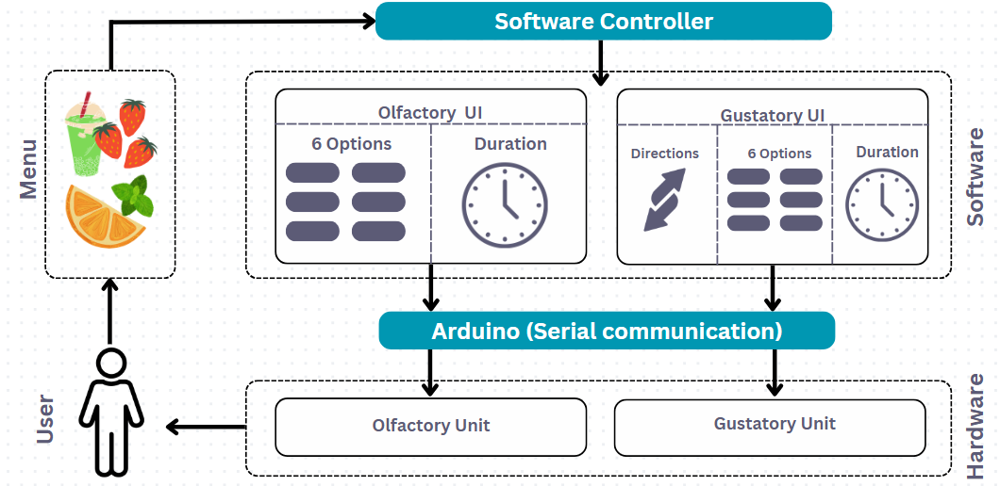
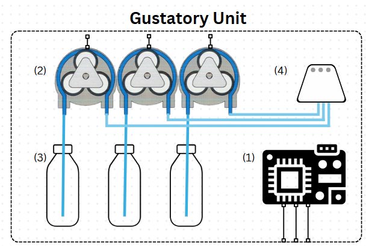
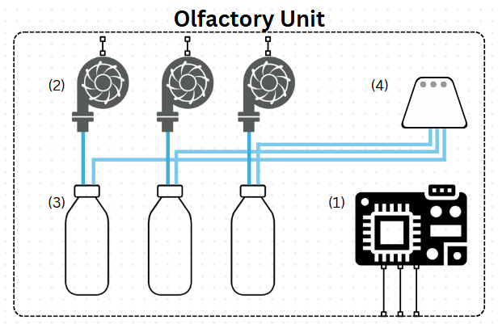
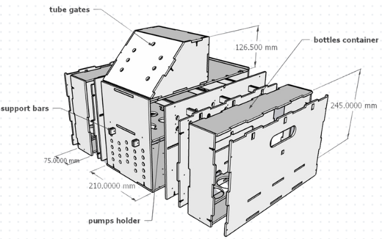

# FlavorSync

**FlavorSync** is a groundbreaking system for simulating and transmitting flavor experiences in digital communication. This project combines software and hardware to create an interactive system for taste and smell synchronization.

---

## 📖 System Overview

FlavorSync integrates **software controllers** and **hardware units** to deliver a seamless sensory experience. The system consists of:

- **Olfactory Unit**: Simulates and delivers smells.
- **Gustatory Unit**: Simulates and delivers taste.
- **Arduino Controller**: Facilitates communication between the software and hardware components.

### System Architecture

The architecture connects a user-friendly software interface to sensory hardware. Key components include:

1. **Menu**: Users select flavor options via an intuitive graphical interface.
2. **Software Controller**: Sends commands to the olfactory and gustatory hardware.
3. **Arduino**: Manages serial communication between software and hardware.
4. **Olfactory and Gustatory Units**: Deliver the selected taste and smell experiences.

---

## 🧩 Hardware Details

### Gustatory Unit

The gustatory unit simulates taste using precision pumps and flavor containers.

- **(1) Arduino Board**: Controls the pumps and coordinates the delivery.
- **(2) Pumps**: Dispense flavor liquids in controlled amounts.
- **(3) Bottles**: Store concentrated flavor liquids.
- **(4) Outlet**: Combines flavors into a single stream for delivery.

### Olfactory Unit

The olfactory unit delivers smells using air pumps and aroma containers.

- **(1) Arduino Board**: Controls air pumps and ensures accurate aroma delivery.
- **(2) Air Pumps**: Generate airflow to carry aromas.
- **(3) Aroma Bottles**: Store scent concentrates.
- **(4) Outlet**: Releases the aroma into the environment.

---

## 🛠 Enclosure Design

The hardware components are housed in a compact, modular enclosure designed for durability and ease of maintenance. Key features include:

- **Bottle Container**: Securely holds flavor and aroma bottles.
- **Pump Holders**: Stabilize the pumps to ensure precision.
- **Support Bars**: Provide structural integrity.
- **Tube Gates**: Organize and route tubing for clean airflow and liquid delivery.

---

## 🌟 How It Works

1. **User Interaction**: The user selects flavors from the menu interface.
2. **Software Command**: The software controller processes the input and sends commands to the Arduino.
3. **Hardware Execution**: The Arduino activates the pumps in the gustatory and olfactory units to deliver the selected taste and smell.
4. **Sensory Output**: The user experiences the synchronized flavor and aroma.

---

## 🎨 Visuals and Demonstrations

To better understand the system and its applications, please refer to the included images and flow diagrams for clarity.

---

For more information or to contribute, visit [FlavorSync Repository](https://github.com/dtnghia2010/Flavour-Communication).
